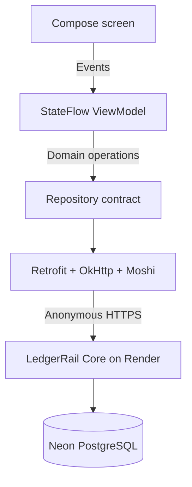

# Architecture

LedgerRail Mobile is a thin, native operator client for the LedgerRail Core sandbox. The backend remains the source of truth; the app never attempts to reproduce ledger rules locally.

## State and data flow

The UI follows unidirectional data flow:

1. `LedgerRailApp` renders one immutable `LedgerRailUiState`.
2. User actions call methods on `LedgerRailViewModel`.
3. The ViewModel validates domain input and calls `LedgerRailRepository`.
4. The repository maps API DTOs to domain models and normalizes network failures.
5. The ViewModel publishes a new state through `StateFlow`.

The repository boundary makes ViewModel tests deterministic and leaves room for a future offline implementation without coupling Compose to Retrofit.

## Correctness choices

- Monetary values use `BigDecimal`; neither the API layer nor UI converts them to floating point.
- A fresh idempotency key is created for each new submission.
- “Replay exact request” intentionally reuses both the prior key and prior payload, demonstrating safe retry behavior.
- Changing the server or account invalidates the replay context.
- Starting a new operation cancels the previous UI job to prevent stale results from overwriting newer state.
- The HTTP client allows HTTPS only, except localhost HTTP used by JVM integration tests.

## Security boundary

The app contains and requests no secret. It calls only LedgerRail Core's anonymous synthetic-transfer endpoints. The backend enforces a per-client minute limit and a PostgreSQL-backed daily write quota; private reconciliation and failed-event replay endpoints are not exposed by the app.

This is appropriate only for a portfolio sandbox containing no real money or personal data. A real payment application would place user authentication and authorization in front of the API, use short-lived tokens, bind access to accounts, protect tokens with platform-backed storage, and apply device and risk controls.

## Free-hosting topology

The Android app does not require a web host: it runs on the phone or emulator and calls the existing Render HTTPS service. Source and CI live on GitHub; a later signed demo APK can be attached to a GitHub Release at no hosting cost. Render may sleep while the monitor is paused, so the first connection can take about a minute.
